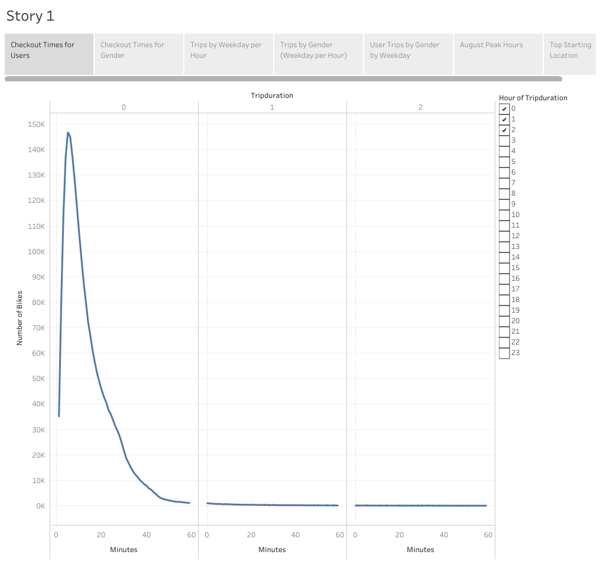
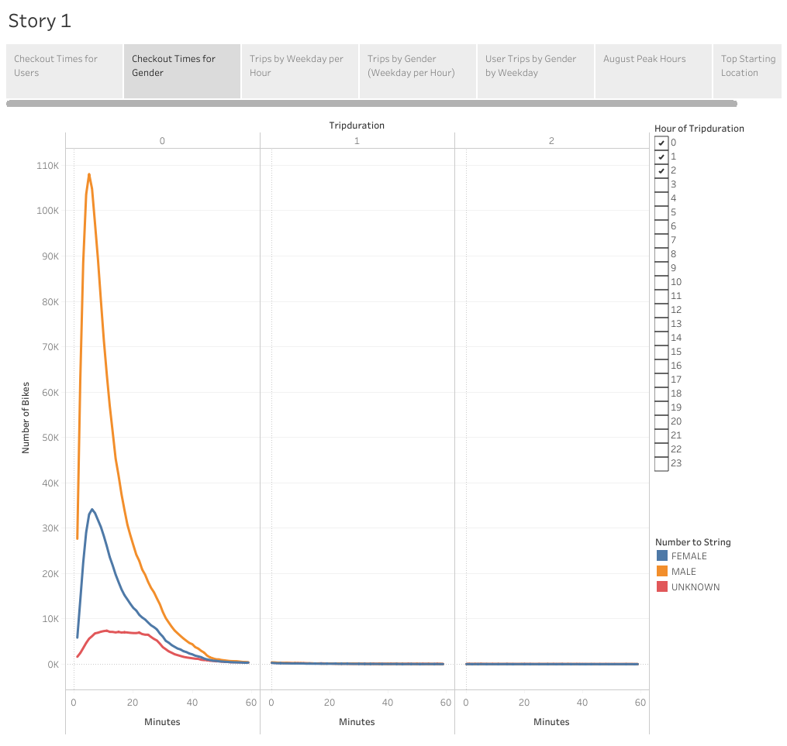
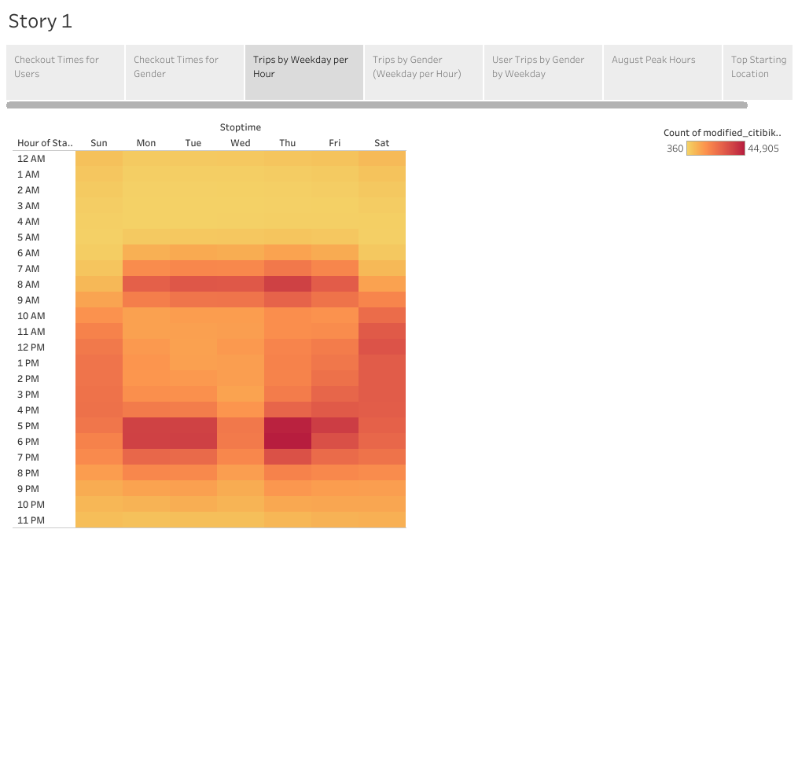
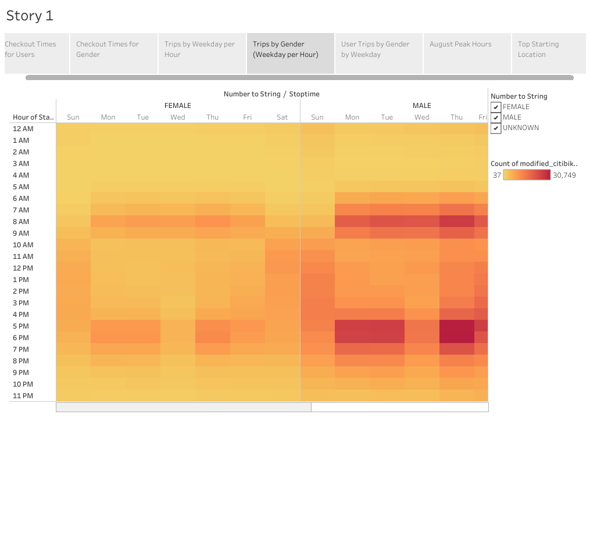
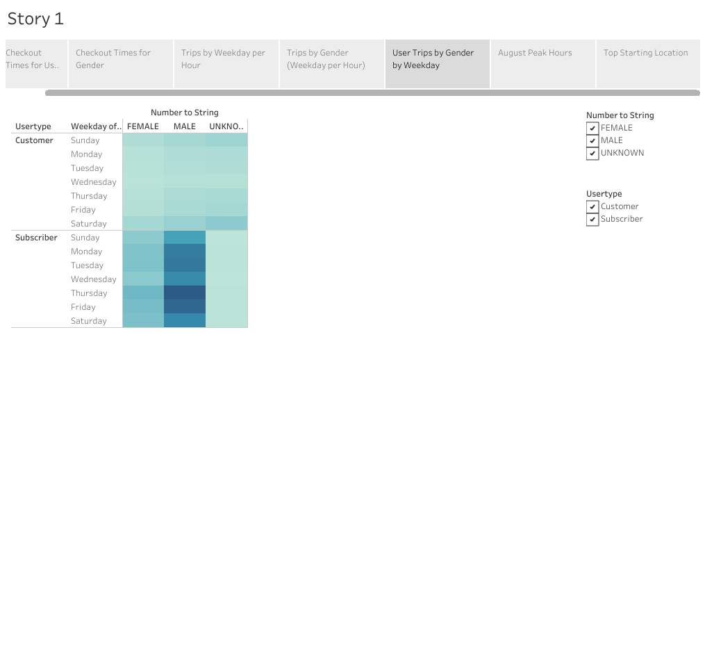
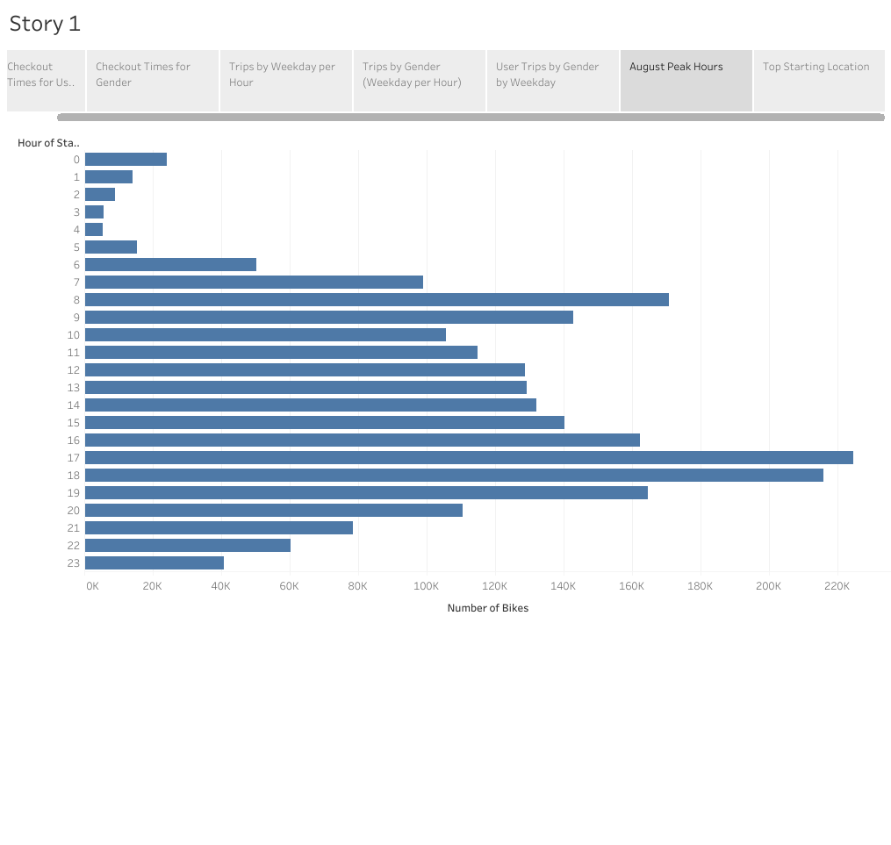
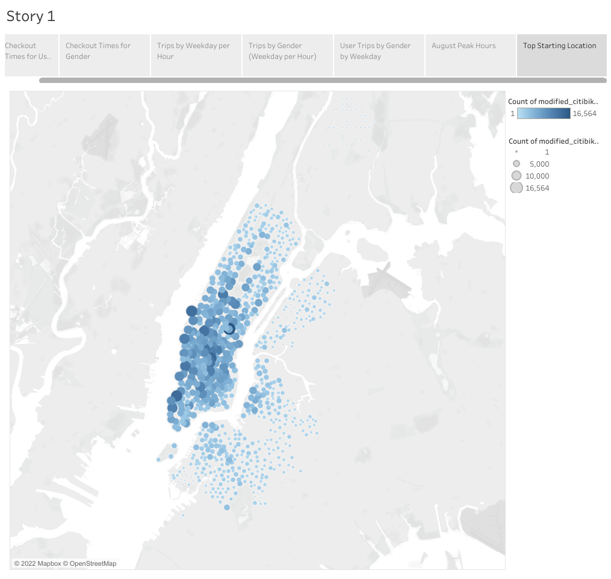

# bikesharing

## Overview of statistical analysis

The goal of this of this project was to use Tableau to show the efficacy of a bike-sharing program in Des Moines Iowa.

### Purpose

In this project I cleaned Citi bike customer data to ensure the visualizations were easy to understand and aesthetically pleasing. I then created 7 visualizations regarding checkout times, usage per hour during weekdays, peak hours, and most 
popular starting locations. I also added filters that provided further breakdowns such as a breakdown by gender, or by number of rides that began in a certain location.

## Results

To see the Tableau story click on the following link:

[link to dashboard](https://public.tableau.com/app/profile/adam.miller6532/viz/CitiBikeStory_16538739445920/Story1?publish=yes)

### Resulting Visualizations

The first visualization shows an overview of checkout times and duration from midnight to 3am in the morning.

This shows that at around midnight the vast majority of rides are between 0 and 20 minutes long, with the largest number of rides having a duration of 5 minutes.  The number of rides taper off during the hours of 1am and 2am, and also 
have similar patterns to the 12am ride duration distribution.

The second visualization shows an overview of checkout times and duration from midnight to 3am in the morning broken down by gender.

This shows that gender did not have much of an impact on ride duration, but that it appears that the number of male customers exceeds the number of female customers by about 3X during the 12am timeframe, but roughly match ride volume
and duration during the 1am and 2am timeframes.

The third visualization shows a heatmap of start time and stop time by each day of the week.

This shows that the most prevalent time for customers to use Citi bikes during the weekday is between 7-9am in the morning and 4-7pm in the evening. This likely implies that they are commonly being used as a method of commuting to work.
This heatmap is dispersed throughout the day during the weekends. This likely implies that they are being used for liesure during the day, but are not commonly used when going out at night.  

The fourth visualization shows a heatmap of start time and stop time by each day of the week broken down by gender.

This shows that male and female customers use Citi bikes at roughly the same times, but that male customers use Citi bikes at far higher frequencies.

The fifth visualization shows a heatmap of per day of the week by gender and whether the user is a subscriber or a casual customer.

This shows that there is a significantly larger amount of use by subscribers every day of the week relative to non-subscribers. This could indicate that the company has done a good job with conversion of customers into subscribers, or
it could indicate that non-subscriber customer fees are disincentivizing use by non-subscribers.

The sixth visualization shows a bar chart showing the breakdown of number of rides per hour during the month of August.

This further indicates that it is likely users use this service most frequently to get to and from work.

The seventh visualization displays a map that shows frequency of starting locations by color and size of the circles at a particular location.

These indicate the density of the number of rides at a particular location, but likely also show a correlation to the most densely populated areas. Further research into demographics and car ownership in these areas would be useful in 
order to identify how to determine where Citi bikes are most likely to be successful.

## Summary

In this project I created some useful visualizations that helped start looking into the feasibility of using Citi bikes in Des Moines. The visualizations created were a bit redundant centered around most popular times of day, location,
and broken down by user type and gender. Additional information can be obtained with additional data and visualizations. The most useful data to help answer the question of feasibility would be car ownership data, age demographic data of 
customers, and user data broken down by months of to determine the seasonality of the product. 

 
### Additional Visualizations for Future Analysis

There are a significant number of visualizations that can be useful for future analysis. The most important visualization would be number of active users per month. This is particularly important in a location like Des Moines where 
during the winter significant amounts of snowfall occur. This could cause the Citi bike service to be undesirable for 3 months of the year and could cause the company to either revaluate whether the location is viable for this type of 
business or if there are other ways to provide customer value during the winter months. Another useful visualization that could be created is a breakdown of usage by customer age and a breakdown of usage by population density. It is 
likely based on the current data collected that the most likely customer is someone of working age, that lives in a heavily populated area. Additional information determined by these two visualizations could help determine where this
business is most likely to be successful. 

